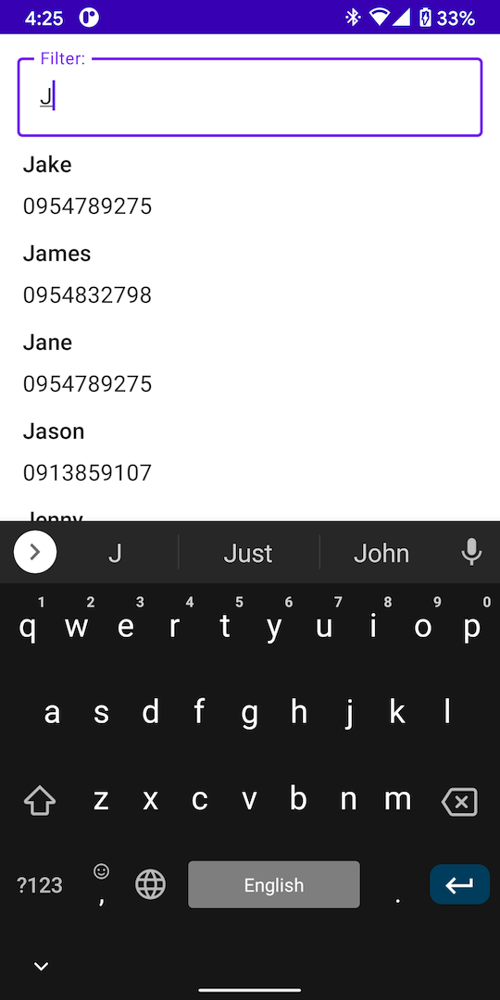

# ContactsCompose

ContactsCompose is a demo contact app written entirely in Jetpack Compose with hardcoded data.

## Preview

## Contributing

Bug reports and pull requests are welcome on GitHub at <https://github.com/Jintin/ContactsCompose>.

## License

The module is available as open source under the terms of
the [MIT License](http://opensource.org/licenses/MIT).